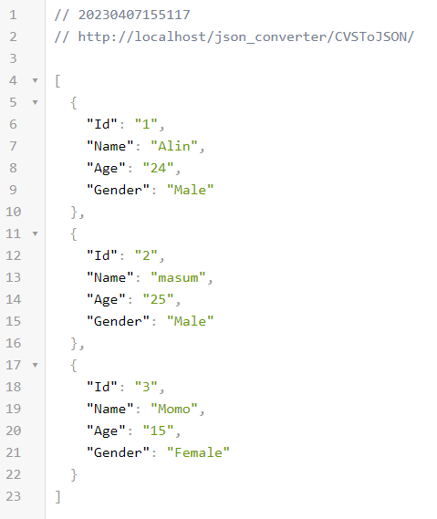

# JSON-Converter by using PHP

You can convert any CSV file, MySQL and API into JSON array.

## Convert from CSV to JSON

Just put your csv file in here and rename it with data.csv, then run csvToJSON.php file and get data as JSON format.

## Convert from MySQL to JSON

Open mysqlToJSON.php file and change the database and table information from $connection and $sql, then run mysqlToJSON.php file and get data as JSON format.

## Convert from MySQL to JSON

Open urlToJSON.php file and change $url value with your API, then run urlToJSON.php file and get data as JSON format.

### Project Version:

1.0.0 (07-April-2023)

### Start Date:

07-April-2023

### Developed by:

Md. Rezwan Saki Alin
https://www.alinsworld.com/

### Used:

<ul>
 <li>Php</li>
</ul>
